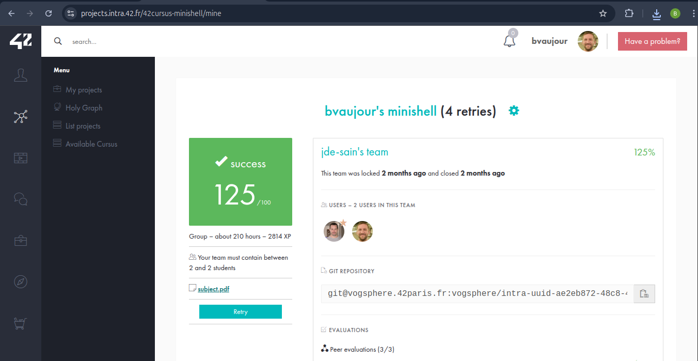

# minishell
[Voir le sujet](./subject.pdf)

Projet de niveau 3 de l'école 42.

Création d’un shell minimal respectant certaines règles POSIX de base. Gestion des pipes, redirections, signaux, ainsi que des opérateurs logiques `&&`, `||`, des wildcards et des parenthèses pour les commandes complexes.

### Fonctionnalités principales :
- **Opérateurs logiques :** Supporte `&&` et `||` pour l’enchaînement des commandes conditionnelles.
- **Wildcards :** Gestion du caractère `*` pour la correspondance des fichiers.
- **Parenthèses :** Gestion de l’exécution de commandes dans un sous-shell avec `()`.
- **Builtins :** Implémentation des commandes internes classiques telles que `echo`, `cd`, `pwd`, `export`, `unset`, et `env`.

